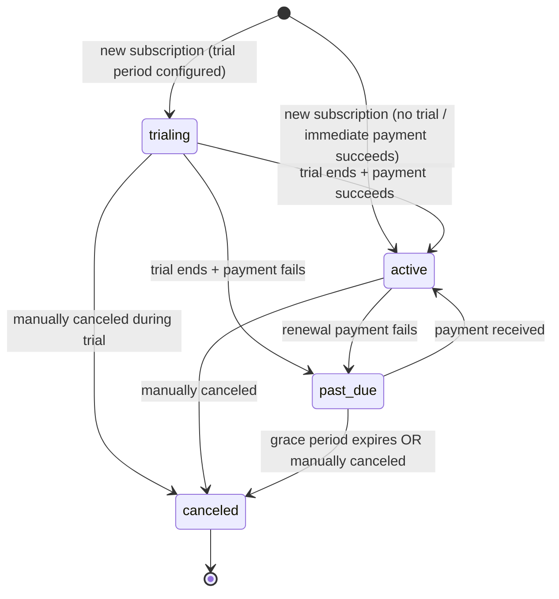

# Round 8 — Billing & Subscriptions: Architectural Blueprint

> [!IMPORTANT]
> This is a **design document only** — no implementation code. Every decision
> here is binding for the Round 8 implementation tasks drafted from it.
> Ambiguities flagged as ⚠️ TEAM DECISION require explicit sign-off before
> implementation begins.

> [!NOTE]
> **SCOPE**: This round covers **tenant-level billing only** — a tenant
> organization billing its own members/clients (a school billing parents,
> a clinic billing patients). Platform-level billing (billing tenant orgs
> for MIS usage) is explicitly a later round. §Q7 flags any tenant-level
> decisions that would make a future platform-level round harder.

---

## Table of Contents

1. [Q1 — Where do billing entities live?](#q1--where-do-billing-entities-live)
2. [Q2 — Payment provider abstraction](#q2--payment-provider-abstraction)
3. [Q3 — Webhook authentication with no session](#q3--webhook-authentication-with-no-session)
4. [Q4 — Idempotency](#q4--idempotency)
5. [Q5 — Subscription lifecycle & usage limits](#q5--subscription-lifecycle--usage-limits)
6. [Q6 — Relationship to the event dispatcher](#q6--relationship-to-the-event-dispatcher)
7. [Q7 — Scope boundary flag for future platform-level billing](#q7--scope-boundary-flag-for-future-platform-level-billing)
8. [Schema Changes Summary (DDL Sketches)](#schema-changes-summary-ddl-sketches)
9. [Change Surface: Existing Files vs. Additive](#change-surface-existing-files-vs-additive)
10. [Open Team Decisions](#open-team-decisions)

---

## Q1 — Where do billing entities live?

### Precedent analysis

| System | Table type | Reasoning |
|---|---|---|
| Event dispatcher | Dedicated hard tables (`event_subscriptions`, `event_execution_log`) | Fixed structure, transactional integrity, status state machine, not per-tenant-customizable |
| Reporting engine | Dedicated hard tables (`report_definitions`, etc.) | Fixed query structure, cross-entity joins, not per-tenant-customizable |
| Custom entities | Schema registry (`entity_types` / `field_definitions` / `entity_records`) | Tenant-defined structure, per-tenant-customizable, runtime schema evolution |

### Options Evaluated

| Criterion | Option A: Dedicated hard tables | Option B: Schema-registry soft-extension layer | Option C: Hard tables + metadata JSONB |
|---|---|---|---|
| **Structural stability** | ✅ Billing has a fixed, non-per-tenant-customizable core: subscriptions have states, invoices have line items, payments have amounts and provider references. This does not vary by org type. | ❌ The entity_records JSONB `data` column has no type enforcement at the DB level. Storing financial amounts as untyped JSONB values loses `NUMERIC` precision guarantees and `CHECK` constraints. | ✅ Core columns are typed and constrained. Tenant-specific fields live in metadata JSONB. |
| **Transactional integrity** | ✅ Foreign keys between subscriptions → invoices → payments are enforced by Postgres. State machine transitions can use CHECK constraints. | ❌ entity_records has no FK relationships between records of different entity types. A "subscription" entity_record cannot have a DB-enforced FK to an "invoice" entity_record. Referential integrity would be application-only. | ✅ Same as Option A. |
| **Provider ID storage** | ✅ Dedicated columns: `stripe_customer_id TEXT`, `mpesa_checkout_request_id TEXT` with appropriate indexes. Type-safe, queryable. | ❌ Provider IDs buried in JSONB `data` — no type safety, no unique index without expression index per field per tenant. | ✅ Same as Option A. |
| **Query performance** | ✅ Standard B-tree indexes on `(tenant_id, status)`, `(tenant_id, due_date)`, etc. Aggregate queries (`SUM(amount) WHERE status = 'paid'`) use native NUMERIC columns. | ❌ Aggregate queries on JSONB values require casting (`(data->>'amount')::NUMERIC`), which defeats index usage and is error-prone. | ✅ Same as Option A for core fields. |
| **Tenant customizability** | ⚠️ Zero flexibility for tenant-specific fields (e.g., a school wanting "academic_term" on invoices, a clinic wanting "insurance_claim_id" on line items). | ✅ Full flexibility — tenants define any field. | ✅ **Best of both**: core structure is fixed, tenant-specific fields go in metadata JSONB with the existing expression-index escalation path (§4.1 of the canonical schema). |
| **Reporting engine integration** | ✅ report_definitions can reference billing tables directly by name — no indirection through entity_type slugs. | ⚠️ Reports would need to join entity_records on entity_type slug, parse JSONB data, and handle schema versioning. Significantly more complex. | ✅ Same as Option A. |

### **Decision: Option C — Dedicated hard tables with metadata JSONB columns**

**Reasoning:** Billing fits the same precedent as the event dispatcher and reporting engine: it has a fixed, non-per-tenant-customizable core structure with transactional integrity requirements (state machines, FK relationships, financial precision). Using the schema-registry layer would sacrifice type safety, referential integrity, and query performance for flexibility that billing's core structure does not need.

However, unlike the event dispatcher, billing has a legitimate per-tenant customization surface. A school's invoice looks different from a clinic's invoice — not in structure (both have line items, amounts, due dates) but in supplementary metadata (academic term, insurance claim ID, department code). The `metadata JSONB` column on select billing tables (invoices, invoice_line_items, billing_customers) provides this flexibility using the same escalation pattern documented in [canonical_postgres_schema.md §4.1](file:///home/nickson/Projects/MIS/canonical_postgres_schema.md#L376-L406).

**Tables introduced** (details in §Schema Changes Summary):
- `billing_customers` — links a tenant's billable entities (parents, patients) to payment provider customer IDs
- `billing_plans` — subscription plan definitions (name, amount, interval, limits)
- `subscriptions` — active/trialing/past_due/canceled subscription instances
- `invoices` — generated invoices with status tracking
- `invoice_line_items` — individual charges on an invoice
- `payment_requests` — provider-agnostic payment attempt records (the internal analog of Stripe's PaymentIntent / M-Pesa's STK Push)
- `payment_webhook_events` — idempotency log for provider webhooks/callbacks

All tables follow the standard tenant RLS pattern: `tenant_id` leading column on every composite PK, `ENABLE ROW LEVEL SECURITY` + `FORCE ROW LEVEL SECURITY`, four-policy `tenant_isolation_*` pattern.

---

## Q2 — Payment provider abstraction

### Structural flow comparison

```
┌─── Stripe ────────────────────────────────────────────────────────┐
│                                                                    │
│  Server: Create PaymentIntent(amount, currency, metadata)          │
│       ↓                                                            │
│  Client: Stripe.js confirms (card details never touch our server)  │
│       ↓                                                            │
│  Stripe webhook: payment_intent.succeeded / .failed                │
│  (async, typically seconds; can retry for hours)                   │
│                                                                    │
└────────────────────────────────────────────────────────────────────┘

┌─── M-Pesa STK Push ──────────────────────────────────────────────┐
│                                                                    │
│  Server: POST /mpesa/stkpush (phone, amount, callbackUrl)          │
│       ↓                                                            │
│  Safaricom sends STK prompt to user's phone                        │
│  User enters PIN (30–90+ second window)                            │
│       ↓                                                            │
│  Safaricom POSTs to callbackUrl with result                        │
│  OR: no callback → server polls /stkpushquery/{checkoutRequestId}  │
│                                                                    │
└────────────────────────────────────────────────────────────────────┘
```

### Where the flows CAN be unified

Both flows share an identical lifecycle from the application's perspective:

1. **Initiate** — the application requests a payment for a specific amount, currency, and payer.
2. **Pend** — the payment is waiting for external resolution (card confirmation / PIN entry).
3. **Resolve** — an external signal (webhook / callback / poll) delivers the outcome: succeeded, failed, or expired.

This maps onto an internal `payment_requests` table with states: `initiated → pending → succeeded | failed | expired`.

### Where the flows CANNOT be unified (do not force false symmetry)

| Concern | Stripe | M-Pesa | Implication |
|---|---|---|---|
| **Payment method shape** | Tokenized card ID (`pm_xxx`) — never touches our server, stored by Stripe | Phone number (`254712345678`) — submitted by the payer or looked up from billing_customers | **Two distinct types**, not one. `StripePaymentMethodRef = { stripePaymentMethodId: string }` vs. `MpesaPaymentMethodRef = { phoneNumber: string }`. Stored in `payment_requests.provider_config JSONB`, not in a shared typed column. |
| **Client-side step** | Required — Stripe.js `confirmPayment()` returns a `clientSecret` to the frontend | None — STK push is entirely server-initiated; the "client" is the user's phone, not our UI | `initiatePayment` return type must be a discriminated union: `{ kind: 'stripe', clientSecret: string }` vs. `{ kind: 'mpesa', checkoutRequestId: string }`. |
| **Resolution mechanism** | Webhook only (Stripe retries for up to 72 hours) | Callback URL (Safaricom POSTs once, no guaranteed retry) + fallback polling via STK Query API | M-Pesa needs a polling fallback; Stripe does not. The polling job is M-Pesa-specific. |
| **Refund flow** | `stripe.refunds.create({ payment_intent: 'pi_xxx' })` — synchronous API, webhook confirmation | M-Pesa B2C reversal — separate API, different auth, asynchronous confirmation | Refunds are provider-specific. The abstraction does not attempt to unify them behind one interface in Round 8. |
| **Currency** | Multi-currency (USD, EUR, KES, etc.) | KES only | `billing_plans.currency` must be validated per-provider. |

### Provider interface contract

```typescript
// lib/billing/providers/types.ts — design-level, not implementation code

interface PaymentProvider {
  readonly slug: 'stripe' | 'mpesa';

  /**
   * Initiate a payment. The result shape differs per provider.
   * Stripe returns a clientSecret for frontend confirmation.
   * M-Pesa returns a checkoutRequestId (no frontend step needed).
   */
  initiatePayment(
    params: InitiatePaymentParams,
    providerConfig: ProviderCredentials,
  ): Promise<InitiatePaymentResult>;

  /**
   * Verify an incoming webhook/callback request.
   * Stripe: cryptographic signature check against webhook signing secret.
   * M-Pesa: URL-embedded secret token + IP allowlist.
   * Returns the verified payload or throws ProviderVerificationError.
   */
  verifyWebhook(
    request: WebhookVerificationInput,
    providerConfig: ProviderCredentials,
  ): Promise<VerifiedProviderEvent>;

  /**
   * Extract the internal payment_request reference from a verified event.
   * Stripe: reads metadata.mis_payment_request_id from the PaymentIntent.
   * M-Pesa: reads the AccountReference or CheckoutRequestID.
   */
  extractPaymentRequestRef(event: VerifiedProviderEvent): string;

  /**
   * Map a verified event to an internal payment status update.
   */
  mapToPaymentUpdate(event: VerifiedProviderEvent): PaymentStatusUpdate;

  /**
   * Query payment status directly from the provider.
   * Primary use: M-Pesa polling fallback when callback does not arrive.
   * Stripe: can implement as a PaymentIntent retrieve call (useful for
   * reconciliation but not the primary resolution path).
   */
  queryPaymentStatus(
    providerPaymentId: string,
    providerConfig: ProviderCredentials,
  ): Promise<PaymentStatusUpdate>;
}
```

**Key types:**

```typescript
interface InitiatePaymentParams {
  paymentRequestId: string;   // internal payment_requests.id
  amountMinorUnits: number;   // amount in smallest currency unit (cents, etc.)
  currency: string;           // ISO 4217: 'KES', 'USD', etc.
  description: string;
  customerRef: string;        // provider customer ID or phone number
  metadata: Record<string, string>;  // passed to provider for round-tripping
}

// Discriminated union — NOT forced into one shape
type InitiatePaymentResult =
  | { kind: 'stripe'; clientSecret: string; stripePaymentIntentId: string }
  | { kind: 'mpesa'; checkoutRequestId: string; merchantRequestId: string };

interface PaymentStatusUpdate {
  providerPaymentId: string;
  status: 'succeeded' | 'failed' | 'expired' | 'pending';
  providerData: Record<string, unknown>;  // raw provider response, stored for audit
  failureReason?: string;
}

// Provider credentials are per-tenant, stored in tenant_provider_configs table
interface ProviderCredentials {
  providerSlug: 'stripe' | 'mpesa';
  credentials: Record<string, string>;  // encrypted at rest
  webhookSecret?: string;               // Stripe webhook signing secret
  callbackToken?: string;               // M-Pesa URL-embedded secret
}
```

**Provider credentials storage:**

Each tenant configures their own payment provider(s) via a `tenant_provider_configs` table. A tenant can have both Stripe and M-Pesa active simultaneously. Credentials are stored as encrypted JSONB (application-layer encryption, not pgcrypto — the encryption key is in the application's env vars, never in the database).

> [!WARNING]
> **⚠️ TEAM DECISION #1:** Should provider credentials be encrypted at rest
> in the database (application-layer AES-256-GCM using an env var key), or
> is it acceptable to store them as plaintext JSONB given that the database
> itself is encrypted at rest (Neon's default)?
> **Recommendation:** Application-layer encryption. Defense-in-depth: a SQL
> injection or misconfigured admin pool query should not expose Stripe secret
> keys or M-Pesa consumer secrets in plaintext. The encryption/decryption
> overhead is negligible (credentials are read once per payment initiation,
> not per query).

---

## Q3 — Webhook authentication with no session

### Problem statement

Webhook/callback requests arrive from Stripe or Safaricom with:
- **No JWT** — the request is not from an authenticated MIS user.
- **No platform admin session** — unlike Round 6's bootstrapping problem, there is no internal actor at all.
- **No tenant context** — the tenant_id must be resolved FROM the payload, not from a session.

This is structurally different from both:
- Normal requests (JWT → session → `withTenantContext(session.tenantId, ...)`)
- Platform admin requests (JWT → platform admin session → `getPlatformAdminPool()`)
- Cron requests (CRON_SECRET header → `getSystemAdminPool()`)

### The webhook authentication flow

```
┌──────────────────────────────────────────────────────────────────────────┐
│  Incoming webhook request (no JWT, no session)                          │
│                                                                         │
│  Step 1: Route-level auth bypass                                        │
│  ├─ Webhook routes are in PUBLIC_ROUTE_PREFIXES (no middleware auth)    │
│  └─ /api/webhooks/stripe, /api/webhooks/mpesa/{callbackToken}          │
│                                                                         │
│  Step 2: Provider-specific verification (BEFORE any DB access)          │
│  ├─ Stripe: verify signature header against STRIPE_WEBHOOK_SECRET      │
│  └─ M-Pesa: verify URL-embedded callbackToken + IP allowlist           │
│                                                                         │
│  Step 3: Tenant resolution via admin pool (cross-tenant lookup)         │
│  ├─ Extract provider payment ref from verified payload                  │
│  ├─ getSystemAdminPool() → query payment_requests for tenant_id        │
│  └─ This is analogous to the cron processor's cross-tenant claim step  │
│                                                                         │
│  Step 4: Enter tenant context for state mutation                        │
│  ├─ withTenantContext(resolvedTenantId, async (client) => { ... })      │
│  ├─ Idempotency check (INSERT into payment_webhook_events)             │
│  ├─ Update payment_requests status                                      │
│  ├─ Update invoice status if applicable                                 │
│  ├─ Dispatch billing event                                              │
│  └─ Write audit log                                                     │
│                                                                         │
│  Step 5: Return 200 to provider (acknowledge receipt)                   │
└──────────────────────────────────────────────────────────────────────────┘
```

### Stripe webhook verification

```typescript
// Conceptual — not implementation code
// Uses stripe.webhooks.constructEvent() which performs HMAC-SHA256
// signature verification against the endpoint's signing secret.

const sig = request.headers.get('stripe-signature');
const body = await request.text();  // raw body, not parsed JSON
const event = stripe.webhooks.constructEvent(body, sig, STRIPE_WEBHOOK_SECRET);
// If verification fails, constructEvent throws — return 400.
```

- `STRIPE_WEBHOOK_SECRET` is a per-deployment env var (the signing secret from Stripe's webhook endpoint configuration).
- This is **not** per-tenant — it's per webhook endpoint. All tenants' Stripe events arrive at the same `/api/webhooks/stripe` endpoint with the same signing secret.
- The tenant-specific Stripe keys are used only for *initiating* payments, not for receiving webhooks.

### M-Pesa callback verification

Safaricom does **not** cryptographically sign callbacks. The standard verification approaches are:

1. **IP allowlisting** — Safaricom publishes their callback source IPs. Check `x-forwarded-for` or the socket address against the allowlist. Fragile if Safaricom changes IPs without notice.
2. **URL-embedded secret token** — When registering the callback URL with Safaricom, include a secret path segment: `/api/webhooks/mpesa/{MPESA_CALLBACK_TOKEN}`. The token is a per-deployment env var. Any request to this URL without the correct token is rejected immediately.
3. **Validation URL** — Safaricom supports a "validation URL" that they call before processing a payment. This is an M-Pesa C2B feature, not directly applicable to STK Push.

**Recommendation:** URL-embedded secret token (primary) + IP allowlist (defense-in-depth).

```typescript
// Route: /api/webhooks/mpesa/[callbackToken]/route.ts
// The [callbackToken] dynamic segment IS the auth mechanism.

const { callbackToken } = params;
if (callbackToken !== process.env.MPESA_CALLBACK_TOKEN) {
  return new Response('Forbidden', { status: 403 });
}

// Defense-in-depth: IP allowlist check
const sourceIp = request.headers.get('x-forwarded-for')?.split(',')[0]?.trim();
if (!SAFARICOM_ALLOWED_IPS.includes(sourceIp)) {
  console.warn(`[mpesa-webhook] Rejected: IP ${sourceIp} not in allowlist`);
  return new Response('Forbidden', { status: 403 });
}
```

### Tenant resolution from webhook payload

Once the webhook is verified, the handler must determine which tenant it belongs to. The mechanism differs by provider but converges on the same internal lookup:

**Stripe:**
- When creating a PaymentIntent, store `metadata: { mis_payment_request_id: '<uuid>' }`.
- The webhook payload contains `event.data.object.metadata.mis_payment_request_id`.
- Look up `payment_requests WHERE id = $1` via admin pool → get `tenant_id`.

**M-Pesa:**
- When initiating STK Push, the `AccountReference` parameter is set to the internal `payment_requests.id`.
- The callback payload contains `Body.stkCallback.CheckoutRequestID`.
- Look up `payment_requests WHERE provider_payment_id = $1 AND provider_slug = 'mpesa'` via admin pool → get `tenant_id`.

**Why admin pool for the lookup?**

The `payment_requests` table has tenant RLS. Without knowing the tenant_id, we cannot use `withTenantContext` (chicken-and-egg). This is exactly the same pattern as the [event processor's cross-tenant claim step](file:///home/nickson/Projects/MIS/lib/events/processor.ts#L84-L117) — use `getSystemAdminPool()` for the initial cross-tenant lookup, then enter `withTenantContext` for the tenant-scoped mutation.

```typescript
// Conceptual flow — not implementation code
const adminPool = getSystemAdminPool();
const adminClient = await adminPool.connect();
try {
  const { rows } = await adminClient.query(
    `SELECT tenant_id FROM payment_requests
     WHERE id = $1`,
    [paymentRequestId]
  );
  if (rows.length === 0) return new Response('Not Found', { status: 404 });
  tenantId = rows[0].tenant_id;
} finally {
  adminClient.release();
}

// Now we have tenantId — enter tenant context for the mutation
await withTenantContext(tenantId, async (client) => {
  // idempotency check, status update, audit log, billing event dispatch
});
```

### Why NOT `getPlatformAdminPool()` for webhooks

`getPlatformAdminPool()` requires a `PlatformAdminSessionPayload` — a human platform admin's JWT. Webhooks have no JWT at all. The correct accessor is `getSystemAdminPool()`, which is designed for "no session, system-initiated" operations (currently used by the cron processor). The webhook is authorized by the provider's signature/token, not by a JWT.

> [!IMPORTANT]
> Webhook route handlers join the same authorization class as the cron
> processor: **system-initiated, secret-verified, no JWT**. They use
> `getSystemAdminPool()` for cross-tenant lookups and `withTenantContext()`
> for tenant-scoped mutations. This is NOT a new pattern — it is the
> existing cron pattern applied to a different external trigger.

---

## Q4 — Idempotency

### Problem

Both providers can redeliver the same event:
- **Stripe**: explicitly retries failed webhook deliveries for up to 72 hours. The same `event.id` may arrive multiple times.
- **M-Pesa**: Safaricom may retry callbacks, and network issues can cause duplicate POSTs. The same `CheckoutRequestID` result may arrive multiple times.

Processing the same payment event twice would double-credit an invoice or create duplicate audit entries.

### Mechanism: `payment_webhook_events` table

A dedicated idempotency log table with a unique constraint on `(provider_slug, provider_event_id)`:

```sql
CREATE TABLE payment_webhook_events (
    tenant_id           UUID NOT NULL REFERENCES organizations(id) ON DELETE CASCADE,
    id                  UUID NOT NULL DEFAULT gen_random_uuid(),
    provider_slug       TEXT NOT NULL CHECK (provider_slug IN ('stripe', 'mpesa')),
    provider_event_id   TEXT NOT NULL,    -- Stripe: event.id, M-Pesa: CheckoutRequestID
    event_type          TEXT NOT NULL,    -- 'payment_intent.succeeded', 'stkpush.result', etc.
    raw_payload         JSONB NOT NULL,   -- full provider payload, stored for audit/debugging
    processed_at        TIMESTAMPTZ NOT NULL DEFAULT now(),

    PRIMARY KEY (tenant_id, id),
    UNIQUE (provider_slug, provider_event_id)  -- idempotency key (cross-tenant unique)
);
```

### Where the check lives relative to the transaction

The idempotency check MUST be **inside** the same transaction that records the payment result. This ensures atomicity:

```
withTenantContext(tenantId, async (client) => {
    // 1. Idempotency check: attempt INSERT into payment_webhook_events
    //    If the row already exists (duplicate key violation), RETURN early.
    //    This INSERT is inside the transaction.
    try {
      await client.query(
        `INSERT INTO payment_webhook_events
           (tenant_id, provider_slug, provider_event_id, event_type, raw_payload)
         VALUES ($1, $2, $3, $4, $5::jsonb)`,
        [tenantId, providerSlug, providerEventId, eventType, rawPayload]
      );
    } catch (err) {
      if (isDuplicateKeyError(err)) {
        // Already processed — return 200 to provider (acknowledge, don't reprocess)
        return { alreadyProcessed: true };
      }
      throw err;  // unexpected error — let the transaction roll back
    }

    // 2. Process the event (update payment_requests, invoices, etc.)
    //    This happens in the SAME transaction as the idempotency INSERT.

    // 3. Write audit log (same transaction)

    // 4. Dispatch billing event (same transaction — writes to event_execution_log)
});
```

**Why inside the transaction:**

If the idempotency INSERT succeeds but the subsequent state mutation fails (and the transaction rolls back), the idempotency record is also rolled back. This means the event can be retried on the next delivery — correct behavior. If the check were outside the transaction, a failed processing attempt would permanently prevent reprocessing.

**Why `UNIQUE (provider_slug, provider_event_id)` is cross-tenant (no `tenant_id` in the unique key):**

A provider event ID is globally unique within that provider (Stripe event IDs are globally unique; M-Pesa CheckoutRequestIDs are globally unique within Safaricom). Including `tenant_id` in the unique constraint would allow the same event to be processed once per tenant — which is wrong, because each event belongs to exactly one tenant.

> [!NOTE]
> The `payment_webhook_events` table serves a dual purpose:
> 1. **Idempotency** — prevent duplicate processing via the unique constraint.
> 2. **Audit trail** — `raw_payload JSONB` stores the full provider response
>    for debugging and compliance. This is separate from `audit_log` (which
>    records the internal state change) and from `event_execution_log` (which
>    records workflow hook executions).

---

## Q5 — Subscription lifecycle & usage limits

### Subscription state machine



### Valid state transitions (enforced at application layer)

| From | To | Trigger |
|---|---|---|
| `trialing` | `active` | Trial period ends, payment method charged successfully |
| `trialing` | `past_due` | Trial period ends, payment fails or no payment method |
| `trialing` | `canceled` | Tenant admin manually cancels during trial |
| `active` | `past_due` | Renewal payment fails (webhook: `invoice.payment_failed`) |
| `active` | `canceled` | Tenant admin manually cancels |
| `past_due` | `active` | Outstanding payment received (webhook: `invoice.paid`) |
| `past_due` | `canceled` | Grace period expires (cron job) or manual cancellation |

**Invalid transitions** (application MUST reject):
- `canceled` → any state (canceled is terminal; to resubscribe, create a new subscription)
- `active` → `trialing` (no "re-trialing" an active subscription)
- Any transition not in the table above

### State transition enforcement

```typescript
// lib/billing/subscriptions.ts — design-level contract

const VALID_TRANSITIONS: Record<SubscriptionStatus, SubscriptionStatus[]> = {
  trialing: ['active', 'past_due', 'canceled'],
  active:   ['past_due', 'canceled'],
  past_due: ['active', 'canceled'],
  canceled: [],  // terminal state
};

function assertValidTransition(from: SubscriptionStatus, to: SubscriptionStatus): void {
  if (!VALID_TRANSITIONS[from].includes(to)) {
    throw new InvalidStateTransitionError(
      `Cannot transition subscription from '${from}' to '${to}'.`
    );
  }
}
```

`InvalidStateTransitionError` is a typed error (like `ForbiddenError`) that route handlers catch and return as HTTP 409 Conflict.

### Subscription DDL sketch

```sql
CREATE TABLE subscriptions (
    tenant_id           UUID NOT NULL REFERENCES organizations(id) ON DELETE CASCADE,
    id                  UUID NOT NULL DEFAULT gen_random_uuid(),
    billing_customer_id UUID NOT NULL,
    plan_id             UUID NOT NULL,
    status              TEXT NOT NULL CHECK (status IN (
                            'trialing', 'active', 'past_due', 'canceled'
                        )) DEFAULT 'trialing',
    provider_slug       TEXT NOT NULL CHECK (provider_slug IN ('stripe', 'mpesa')),
    provider_subscription_id TEXT,        -- Stripe subscription ID (NULL for M-Pesa, which has no native subscription concept)
    current_period_start TIMESTAMPTZ NOT NULL,
    current_period_end   TIMESTAMPTZ NOT NULL,
    trial_end            TIMESTAMPTZ,     -- NULL = no trial
    canceled_at          TIMESTAMPTZ,     -- NULL = not canceled
    cancel_reason        TEXT,
    metadata             JSONB NOT NULL DEFAULT '{}',
    created_at           TIMESTAMPTZ NOT NULL DEFAULT now(),
    updated_at           TIMESTAMPTZ NOT NULL DEFAULT now(),

    PRIMARY KEY (tenant_id, id),
    FOREIGN KEY (tenant_id, billing_customer_id)
        REFERENCES billing_customers(tenant_id, id) ON DELETE CASCADE,
    FOREIGN KEY (tenant_id, plan_id)
        REFERENCES billing_plans(tenant_id, id)
);
```

### Usage limits

**Recommendation: Hard block with typed error, consistent with the existing philosophy of typed errors over silent failures.**

The MIS codebase consistently uses typed errors (`ForbiddenError`, `SsoOnlyUserError`) over silent failures. Usage limit enforcement follows the same pattern: a `BillingLimitExceeded` typed error that the caller must handle.

```typescript
// lib/billing/usage.ts — design-level contract

export class BillingLimitExceeded extends Error {
  public readonly code = 'BILLING_LIMIT_EXCEEDED' as const;
  public readonly resource: string;
  public readonly currentUsage: number;
  public readonly planLimit: number;

  constructor(resource: string, currentUsage: number, planLimit: number) {
    super(
      `Usage limit exceeded for '${resource}': ` +
      `current ${currentUsage}, limit ${planLimit}. ` +
      `Upgrade the subscription plan to increase this limit.`
    );
    this.name = 'BillingLimitExceeded';
    this.resource = resource;
    this.currentUsage = currentUsage;
    this.planLimit = planLimit;
  }
}

/**
 * Checks whether adding `delta` units of `resource` would exceed the
 * active plan's limit for the current tenant.
 *
 * @throws {BillingLimitExceeded} if the limit would be exceeded.
 * @throws {NoActiveSubscriptionError} if the tenant has no active subscription.
 *
 * Call this BEFORE the write that would consume the resource — not after.
 * The check and the write should be in the same transaction to prevent
 * TOCTOU races.
 */
async function checkUsageLimit(
  client: PoolClient,
  tenantId: string,
  resource: string,
  delta: number,
): Promise<void>;
```

**Enforcement point:** `checkUsageLimit` is called by the service function that performs the write (e.g., `createUser`, `createEntityRecord`) — NOT in middleware, NOT in the route handler. This keeps enforcement close to the data mutation and inside the same transaction.

**Plan limits schema:**

```sql
-- billing_plans.limits JSONB stores per-resource limits:
-- { "users": 100, "entity_records": 10000, "storage_mb": 5120 }
-- NULL or absent key = unlimited for that resource.
```

**Usage tracking:**

Usage is computed on-the-fly via COUNT queries, not maintained as a separate counter table. This avoids counter-drift issues:

```sql
-- Example: checking user count against plan limit
SELECT COUNT(*) AS current_usage
FROM users
WHERE tenant_id = $1 AND is_active = TRUE;
```

For resources where COUNT is expensive (e.g., storage), a `usage_snapshots` table can cache periodic counts. This is a performance optimization, not a correctness requirement — the authoritative count is always the live query.

> [!WARNING]
> **⚠️ TEAM DECISION #2:** Should usage limit enforcement be **mandatory** for
> all tenants (every tenant must have an active subscription to use the system),
> or **opt-in** (tenants without a subscription have unlimited access, and
> limits only apply once a plan is configured)?
> **Recommendation:** Opt-in. Requiring a subscription before a tenant can
> operate would break the existing bootstrapping flow (a newly created tenant
> has no subscription yet). The `checkUsageLimit` function returns immediately
> (no-op) if the tenant has no active subscription, and enforces limits only
> when a subscription with plan limits exists.

---

## Q6 — Relationship to the event dispatcher

### Analysis: are billing mutations `createEntityRecord`-style calls?

No. Billing state changes originate from two structurally different code paths:

| Code path | Origin | How it enters the system | Current dispatcher support |
|---|---|---|---|
| Entity record mutations | User-initiated API call | `createEntityRecord()` / `updateEntityRecord()` → calls `dispatchEntityEvent()` inside the same transaction | ✅ Fully supported |
| Billing state changes | External webhook/callback (Stripe/M-Pesa) OR cron job (subscription expiry) | Webhook route handler → `withTenantContext()` → update `payment_requests`/`invoices`/`subscriptions` | ❌ Not supported — no `entityTypeId`, no `MutationEvent` shape |

The existing `dispatchEntityEvent` takes a [MutationEvent](file:///home/nickson/Projects/MIS/lib/events/types.ts#L9-L22) with `entityTypeId`, `sourceType: 'core_entity' | 'custom_entity'`, `schemaVersion`, `changedFields`, etc. Billing events do not have entity type IDs or schema versions — they have provider-specific data, payment amounts, and subscription statuses.

### Options Evaluated

| Criterion | Option A: Force billing events through `dispatchEntityEvent` | Option B: New `dispatchBillingEvent` → existing `event_execution_log` | Option C: Completely separate notification pipeline |
|---|---|---|---|
| **Data shape** | ❌ Would require fabricating a `MutationEvent` with fake `entityTypeId`, `schemaVersion`, etc. The processor would then need to recognize billing-flavored MutationEvents and handle them differently. Breaks the type contract. | ✅ New `BillingEvent` type with billing-specific fields. Writes to the same `event_execution_log` table with `source_type = 'billing'`. | ✅ Clean separation, but duplicates infrastructure. |
| **Tenant configurability** | ✅ Tenant admins can configure `event_subscriptions` to react to billing events (e.g., "when invoice.paid, send email"). | ✅ Same — `event_subscriptions` with `source_type = 'billing'` and `source_target = 'invoice.paid'` works with the existing subscription model. | ❌ Would need a separate subscription/configuration table for billing notifications. |
| **Processing infrastructure reuse** | ✅ Reuses the existing cron poller and action executors. | ✅ Same — log rows are processed by the same `processPendingEvents()` cron job. | ❌ New processor, new cron job, new log table. Unjustified duplication. |
| **Schema change** | ⚠️ `event_subscriptions.source_type` CHECK constraint needs `'billing'` added. | ⚠️ Same schema change. | None (separate table). |
| **Dispatcher code complexity** | ❌ `dispatchEntityEvent` would need branching logic for billing vs. entity events, polluting a clean function. | ✅ Separate `dispatchBillingEvent` function — clean separation of concerns. `dispatchEntityEvent` remains unchanged. | ✅ Same separation. |

### **Decision: Option B — New `dispatchBillingEvent` function, reusing `event_execution_log`**

**Reasoning:** The processing infrastructure (cron poller, action executors, retry logic) is substantial and should not be duplicated. The event_subscriptions table already supports arbitrary source types — adding `'billing'` to the CHECK constraint is the designed extension point. But the dispatch function must be separate because billing events have a fundamentally different shape from entity mutation events.

### `dispatchBillingEvent` contract

```typescript
// lib/billing/events.ts — design-level contract

interface BillingEvent {
  tenantId: string;
  eventType: string;          // 'invoice.paid', 'subscription.canceled', etc.
  resourceType: string;       // 'invoice', 'subscription', 'payment_request'
  resourceId: string;         // the billing entity's UUID
  actorId: string | null;     // NULL for webhook-originated events (no human actor)
  data: Record<string, unknown>;  // event-specific payload (amounts, statuses, etc.)
  timestamp: string;
}

/**
 * Dispatches a billing event to matching event_subscriptions.
 * 
 * Runs inside the caller's existing transaction (same pattern as
 * dispatchEntityEvent). Inserts one event_execution_log row per
 * matching subscription.
 *
 * Called from webhook handlers and subscription lifecycle functions
 * (not from createEntityRecord).
 */
async function dispatchBillingEvent(
  client: PoolClient,
  event: BillingEvent,
): Promise<void>;
```

**Schema change required:**

```sql
-- Add 'billing' to the source_type CHECK constraint on event_subscriptions
ALTER TABLE event_subscriptions
  DROP CONSTRAINT event_subscriptions_source_type_check,
  ADD CONSTRAINT event_subscriptions_source_type_check
    CHECK (source_type IN ('core_entity', 'custom_entity', 'billing'));
```

**How tenant admins use this:**

A tenant admin can create an event subscription like:
```json
{
  "name": "Email receipt on payment",
  "source_type": "billing",
  "source_target": "invoice.paid",
  "event": "created",
  "action_type": "send_email_template",
  "action_config": { "template_id": "payment_receipt", "recipient_field": "email" }
}
```

The existing [action executors](file:///home/nickson/Projects/MIS/lib/events/actions) (`send_email_template`, `webhook`, `internal_notification`) work unchanged — they receive the `BillingEvent` data in `request_payload` and process it identically to entity mutation events.

> [!IMPORTANT]
> The `dispatchBillingEvent` function stores the serialized `BillingEvent` in
> `event_execution_log.request_payload`, exactly as `dispatchEntityEvent`
> stores the serialized `MutationEvent`. The processor does not need to know
> the payload shape — it passes `request_payload` to the action executor,
> which uses it as opaque JSONB context.

---

## Q7 — Scope boundary flag for future platform-level billing

### What "platform-level billing" would look like

Platform-level billing = the MIS platform billing tenant organizations for their usage of MIS itself. Different payer (tenant org), different payee (MIS operator), different metrics (API calls, storage, active users), potentially different providers.

### Dependency risk assessment

| Tenant-level decision | Impact on future platform-level round | Risk level |
|---|---|---|
| **Provider abstraction code** (`lib/billing/providers/`) | Platform-level billing would also use Stripe/M-Pesa. The same `PaymentProvider` interface and provider implementations can be reused — they accept `ProviderCredentials` as a parameter, not from env vars. | 🟢 **No conflict.** Provider code is parameterized and reusable. |
| **Provider credentials storage** (`tenant_provider_configs` table) | Platform-level billing would use MIS-owned Stripe/M-Pesa credentials, not tenant-owned. These would be stored in env vars or a separate `platform_provider_configs` table, not in `tenant_provider_configs`. | 🟢 **No conflict.** Separate credential stores, separate config paths. |
| **Webhook endpoints** (`/api/webhooks/stripe`, `/api/webhooks/mpesa/...`) | Platform-level billing would need separate webhook endpoints (e.g., `/api/webhooks/platform/stripe`) because the signing secret, tenant resolution logic, and processing pipeline are all different. | 🟡 **Minor complexity.** Requires a second set of webhook routes. The provider verification code is reusable; only the routing and tenant-resolution differ. |
| **`billing_customers` table** (tenant-scoped, links tenant's own customers) | Platform-level billing would need a separate `platform_billing_customers` table linking to `organizations.id` (the tenant IS the customer, not the tenant's client). | 🟢 **No conflict.** Structurally separate tables. |
| **`billing_plans` table** (tenant-scoped) | Platform-level billing would have its own `platform_billing_plans` table managed by the MIS operator, not by tenant admins. | 🟢 **No conflict.** |
| **`subscriptions` table** (tenant-scoped) | Platform-level subscriptions would live in a `platform_subscriptions` table with no RLS, managed via `getPlatformAdminPool`. Same state machine, different table. | 🟡 **Potential code duplication.** The subscription state machine logic (valid transitions, grace period calculation) could be extracted into a shared utility. If we hardcode the state machine into the tenant `subscriptions` service, we'll need to duplicate it for platform subscriptions. **Recommendation:** Keep state machine logic in a pure function (`assertValidTransition`, `calculateGracePeriod`) that is table-agnostic. |
| **`event_subscriptions.source_type = 'billing'`** | Platform-level billing events would need a `source_type = 'platform_billing'` (or similar) — they cannot reuse `'billing'` because platform billing events have no tenant_id context for RLS-scoped event_subscriptions. Platform billing notifications would need their own pipeline (not tenant event_subscriptions). | 🟡 **Minor complexity.** Platform billing notifications are a platform-admin concern, not a tenant-admin concern. They would use a separate notification mechanism (email to platform admins, Slack webhook, etc.), not the tenant event_subscriptions table. |
| **Usage limit enforcement** (`checkUsageLimit`) | If platform-level billing also enforces usage limits (e.g., "your tenant is on the Free plan, limited to 50 users"), the `checkUsageLimit` function would need to check BOTH tenant-level limits (from the tenant's own billing plan) AND platform-level limits (from the MIS operator's plan for this tenant). | 🟠 **Moderate risk.** If `checkUsageLimit` is designed to only read from tenant-scoped `subscriptions` + `billing_plans`, adding a platform-level check later requires modifying its signature and logic. **Recommendation:** Design `checkUsageLimit` to accept an optional `platformLimitOverride` parameter (defaulting to `undefined` / no check). This reserves the extension point without implementing it. |

### Summary

> [!NOTE]
> **No tenant-level decision in this blueprint creates a blocking conflict**
> with a future platform-level billing round. The main risks are:
>
> 1. **Subscription state machine code duplication** — mitigated by keeping
>    transition logic in pure, table-agnostic functions.
> 2. **Usage limit dual enforcement** — mitigated by designing `checkUsageLimit`
>    with an extension point for platform-level overrides.
> 3. **Webhook endpoint proliferation** — acceptable; separate endpoints for
>    separate concerns is the cleaner architecture.

---

## Schema Changes Summary (DDL Sketches)

> [!NOTE]
> These are design-level DDL sketches. They are NOT deployment-ready migrations.
> A separate migration file will be produced in the implementation pass.

### New table: `tenant_provider_configs`

```sql
-- Per-tenant payment provider configuration.
-- A tenant can have multiple providers active simultaneously.
-- Credentials are encrypted at rest (application-layer, see TEAM DECISION #1).

CREATE TABLE tenant_provider_configs (
    tenant_id           UUID NOT NULL REFERENCES organizations(id) ON DELETE CASCADE,
    id                  UUID NOT NULL DEFAULT gen_random_uuid(),
    provider_slug       TEXT NOT NULL CHECK (provider_slug IN ('stripe', 'mpesa')),
    display_name        TEXT NOT NULL DEFAULT '',
    is_active           BOOLEAN NOT NULL DEFAULT TRUE,
    credentials_encrypted BYTEA NOT NULL,     -- AES-256-GCM encrypted JSONB
    webhook_secret      TEXT,                 -- Stripe webhook signing secret (per-tenant if using Connect)
    callback_token      TEXT,                 -- M-Pesa URL-embedded callback token
    config              JSONB NOT NULL DEFAULT '{}',  -- provider-specific non-secret config
    created_at          TIMESTAMPTZ NOT NULL DEFAULT now(),
    updated_at          TIMESTAMPTZ NOT NULL DEFAULT now(),

    PRIMARY KEY (tenant_id, id),
    UNIQUE (tenant_id, provider_slug)  -- one config per provider per tenant
);

-- Standard tenant RLS pattern
ALTER TABLE tenant_provider_configs ENABLE ROW LEVEL SECURITY;
ALTER TABLE tenant_provider_configs FORCE ROW LEVEL SECURITY;
CREATE POLICY tenant_isolation_select ON tenant_provider_configs
    FOR SELECT USING (tenant_id = current_tenant_id());
CREATE POLICY tenant_isolation_insert ON tenant_provider_configs
    FOR INSERT WITH CHECK (tenant_id = current_tenant_id());
CREATE POLICY tenant_isolation_update ON tenant_provider_configs
    FOR UPDATE USING (tenant_id = current_tenant_id())
    WITH CHECK (tenant_id = current_tenant_id());
CREATE POLICY tenant_isolation_delete ON tenant_provider_configs
    FOR DELETE USING (tenant_id = current_tenant_id());
```

> [!WARNING]
> **⚠️ TEAM DECISION #3:** Should `tenant_provider_configs` be readable
> by `mis_app`, or should credential access be restricted to a specific
> billing service function that decrypts on-demand? If readable by
> `mis_app`, any code running under `withTenantContext` can SELECT the
> encrypted credentials (though they'd still need the encryption key to
> decrypt). Recommendation: readable by `mis_app` (RLS scoped to the
> tenant), with decryption gated by a dedicated `getProviderCredentials()`
> function that requires a specific permission codename (e.g.,
> `'billing:manage'`).

---

### New table: `billing_customers`

```sql
-- Links a tenant's billable entities (parents, patients, members) to
-- payment provider customer records.

CREATE TABLE billing_customers (
    tenant_id           UUID NOT NULL REFERENCES organizations(id) ON DELETE CASCADE,
    id                  UUID NOT NULL DEFAULT gen_random_uuid(),
    display_name        TEXT NOT NULL,
    email               TEXT,
    phone               TEXT,                 -- required for M-Pesa
    stripe_customer_id  TEXT,                 -- Stripe Customer ID (cus_xxx)
    user_id             UUID,                 -- optional FK to users table (if the customer is also a system user)
    metadata            JSONB NOT NULL DEFAULT '{}',  -- tenant-specific fields
    is_active           BOOLEAN NOT NULL DEFAULT TRUE,
    created_at          TIMESTAMPTZ NOT NULL DEFAULT now(),
    updated_at          TIMESTAMPTZ NOT NULL DEFAULT now(),

    PRIMARY KEY (tenant_id, id),
    FOREIGN KEY (tenant_id, user_id) REFERENCES users(tenant_id, id) ON DELETE SET NULL
);

CREATE INDEX idx_billing_customers_stripe
    ON billing_customers (stripe_customer_id)
    WHERE stripe_customer_id IS NOT NULL;

CREATE INDEX idx_billing_customers_phone
    ON billing_customers (tenant_id, phone)
    WHERE phone IS NOT NULL;

CREATE INDEX idx_billing_customers_metadata
    ON billing_customers USING GIN (metadata);

-- Standard tenant RLS (four-policy pattern)
ALTER TABLE billing_customers ENABLE ROW LEVEL SECURITY;
ALTER TABLE billing_customers FORCE ROW LEVEL SECURITY;
CREATE POLICY tenant_isolation_select ON billing_customers
    FOR SELECT USING (tenant_id = current_tenant_id());
CREATE POLICY tenant_isolation_insert ON billing_customers
    FOR INSERT WITH CHECK (tenant_id = current_tenant_id());
CREATE POLICY tenant_isolation_update ON billing_customers
    FOR UPDATE USING (tenant_id = current_tenant_id())
    WITH CHECK (tenant_id = current_tenant_id());
CREATE POLICY tenant_isolation_delete ON billing_customers
    FOR DELETE USING (tenant_id = current_tenant_id());
```

---

### New table: `billing_plans`

```sql
CREATE TABLE billing_plans (
    tenant_id           UUID NOT NULL REFERENCES organizations(id) ON DELETE CASCADE,
    id                  UUID NOT NULL DEFAULT gen_random_uuid(),
    name                TEXT NOT NULL,
    description         TEXT NOT NULL DEFAULT '',
    amount_minor_units  BIGINT NOT NULL,      -- amount in smallest currency unit
    currency            TEXT NOT NULL DEFAULT 'KES',  -- ISO 4217
    interval            TEXT NOT NULL CHECK (interval IN (
                            'daily', 'weekly', 'monthly', 'quarterly', 'yearly', 'one_time'
                        )),
    interval_count      INT NOT NULL DEFAULT 1,  -- e.g., 2 with 'monthly' = every 2 months
    trial_days          INT NOT NULL DEFAULT 0,
    limits              JSONB NOT NULL DEFAULT '{}',  -- { "users": 100, "entity_records": 10000 }
    stripe_price_id     TEXT,                 -- Stripe Price ID (if synced)
    is_active           BOOLEAN NOT NULL DEFAULT TRUE,
    created_at          TIMESTAMPTZ NOT NULL DEFAULT now(),
    updated_at          TIMESTAMPTZ NOT NULL DEFAULT now(),

    PRIMARY KEY (tenant_id, id),
    UNIQUE (tenant_id, name)
);

-- Standard tenant RLS (four-policy pattern)
ALTER TABLE billing_plans ENABLE ROW LEVEL SECURITY;
ALTER TABLE billing_plans FORCE ROW LEVEL SECURITY;
CREATE POLICY tenant_isolation_select ON billing_plans
    FOR SELECT USING (tenant_id = current_tenant_id());
CREATE POLICY tenant_isolation_insert ON billing_plans
    FOR INSERT WITH CHECK (tenant_id = current_tenant_id());
CREATE POLICY tenant_isolation_update ON billing_plans
    FOR UPDATE USING (tenant_id = current_tenant_id())
    WITH CHECK (tenant_id = current_tenant_id());
CREATE POLICY tenant_isolation_delete ON billing_plans
    FOR DELETE USING (tenant_id = current_tenant_id());
```

---

### New table: `subscriptions`

*(See §Q5 for the full DDL sketch and state machine.)*

```sql
-- Standard tenant RLS (four-policy pattern)
ALTER TABLE subscriptions ENABLE ROW LEVEL SECURITY;
ALTER TABLE subscriptions FORCE ROW LEVEL SECURITY;
CREATE POLICY tenant_isolation_select ON subscriptions
    FOR SELECT USING (tenant_id = current_tenant_id());
CREATE POLICY tenant_isolation_insert ON subscriptions
    FOR INSERT WITH CHECK (tenant_id = current_tenant_id());
CREATE POLICY tenant_isolation_update ON subscriptions
    FOR UPDATE USING (tenant_id = current_tenant_id())
    WITH CHECK (tenant_id = current_tenant_id());
CREATE POLICY tenant_isolation_delete ON subscriptions
    FOR DELETE USING (tenant_id = current_tenant_id());

CREATE INDEX idx_subscriptions_customer
    ON subscriptions (tenant_id, billing_customer_id);
CREATE INDEX idx_subscriptions_status
    ON subscriptions (tenant_id, status)
    WHERE status IN ('active', 'trialing', 'past_due');
CREATE INDEX idx_subscriptions_provider
    ON subscriptions (provider_slug, provider_subscription_id)
    WHERE provider_subscription_id IS NOT NULL;
```

---

### New table: `invoices`

```sql
CREATE TABLE invoices (
    tenant_id           UUID NOT NULL REFERENCES organizations(id) ON DELETE CASCADE,
    id                  UUID NOT NULL DEFAULT gen_random_uuid(),
    subscription_id     UUID,                 -- NULL for one-time invoices
    billing_customer_id UUID NOT NULL,
    invoice_number      TEXT NOT NULL,         -- tenant-scoped sequential number
    status              TEXT NOT NULL CHECK (status IN (
                            'draft', 'open', 'paid', 'void', 'uncollectible'
                        )) DEFAULT 'draft',
    subtotal_minor_units BIGINT NOT NULL DEFAULT 0,
    tax_minor_units      BIGINT NOT NULL DEFAULT 0,
    total_minor_units    BIGINT NOT NULL DEFAULT 0,
    currency             TEXT NOT NULL DEFAULT 'KES',
    due_date             DATE,
    paid_at              TIMESTAMPTZ,
    stripe_invoice_id    TEXT,                -- Stripe Invoice ID (if synced)
    metadata             JSONB NOT NULL DEFAULT '{}',
    created_at           TIMESTAMPTZ NOT NULL DEFAULT now(),
    updated_at           TIMESTAMPTZ NOT NULL DEFAULT now(),

    PRIMARY KEY (tenant_id, id),
    UNIQUE (tenant_id, invoice_number),
    FOREIGN KEY (tenant_id, subscription_id)
        REFERENCES subscriptions(tenant_id, id) ON DELETE SET NULL,
    FOREIGN KEY (tenant_id, billing_customer_id)
        REFERENCES billing_customers(tenant_id, id) ON DELETE CASCADE
);

CREATE INDEX idx_invoices_status
    ON invoices (tenant_id, status, due_date);
CREATE INDEX idx_invoices_customer
    ON invoices (tenant_id, billing_customer_id, created_at DESC);
CREATE INDEX idx_invoices_metadata
    ON invoices USING GIN (metadata);

-- Standard tenant RLS (four-policy pattern)
ALTER TABLE invoices ENABLE ROW LEVEL SECURITY;
ALTER TABLE invoices FORCE ROW LEVEL SECURITY;
CREATE POLICY tenant_isolation_select ON invoices
    FOR SELECT USING (tenant_id = current_tenant_id());
CREATE POLICY tenant_isolation_insert ON invoices
    FOR INSERT WITH CHECK (tenant_id = current_tenant_id());
CREATE POLICY tenant_isolation_update ON invoices
    FOR UPDATE USING (tenant_id = current_tenant_id())
    WITH CHECK (tenant_id = current_tenant_id());
CREATE POLICY tenant_isolation_delete ON invoices
    FOR DELETE USING (tenant_id = current_tenant_id());
```

---

### New table: `invoice_line_items`

```sql
CREATE TABLE invoice_line_items (
    tenant_id           UUID NOT NULL,
    invoice_id          UUID NOT NULL,
    id                  UUID NOT NULL DEFAULT gen_random_uuid(),
    description         TEXT NOT NULL,
    quantity            INT NOT NULL DEFAULT 1,
    unit_amount_minor_units BIGINT NOT NULL,
    total_minor_units   BIGINT NOT NULL,      -- quantity * unit_amount (application-computed)
    metadata            JSONB NOT NULL DEFAULT '{}',  -- tenant-specific fields (term, department, etc.)
    created_at          TIMESTAMPTZ NOT NULL DEFAULT now(),

    PRIMARY KEY (tenant_id, id),
    FOREIGN KEY (tenant_id, invoice_id)
        REFERENCES invoices(tenant_id, id) ON DELETE CASCADE
);

CREATE INDEX idx_invoice_line_items_invoice
    ON invoice_line_items (tenant_id, invoice_id);

-- Standard tenant RLS (four-policy pattern)
ALTER TABLE invoice_line_items ENABLE ROW LEVEL SECURITY;
ALTER TABLE invoice_line_items FORCE ROW LEVEL SECURITY;
CREATE POLICY tenant_isolation_select ON invoice_line_items
    FOR SELECT USING (tenant_id = current_tenant_id());
CREATE POLICY tenant_isolation_insert ON invoice_line_items
    FOR INSERT WITH CHECK (tenant_id = current_tenant_id());
CREATE POLICY tenant_isolation_update ON invoice_line_items
    FOR UPDATE USING (tenant_id = current_tenant_id())
    WITH CHECK (tenant_id = current_tenant_id());
CREATE POLICY tenant_isolation_delete ON invoice_line_items
    FOR DELETE USING (tenant_id = current_tenant_id());
```

---

### New table: `payment_requests`

```sql
-- Provider-agnostic payment attempt records.
-- This is the internal representation that both Stripe PaymentIntents
-- and M-Pesa STK Pushes map onto.

CREATE TABLE payment_requests (
    tenant_id           UUID NOT NULL REFERENCES organizations(id) ON DELETE CASCADE,
    id                  UUID NOT NULL DEFAULT gen_random_uuid(),
    invoice_id          UUID,                 -- NULL for ad-hoc payments not tied to an invoice
    billing_customer_id UUID NOT NULL,
    provider_slug       TEXT NOT NULL CHECK (provider_slug IN ('stripe', 'mpesa')),
    provider_payment_id TEXT,                 -- Stripe PaymentIntent ID / M-Pesa CheckoutRequestID
    amount_minor_units  BIGINT NOT NULL,
    currency            TEXT NOT NULL DEFAULT 'KES',
    status              TEXT NOT NULL CHECK (status IN (
                            'initiated', 'pending', 'succeeded', 'failed', 'expired'
                        )) DEFAULT 'initiated',
    provider_config     JSONB NOT NULL DEFAULT '{}',  -- provider-specific data (clientSecret, merchantRequestId, etc.)
    failure_reason      TEXT,
    created_at          TIMESTAMPTZ NOT NULL DEFAULT now(),
    updated_at          TIMESTAMPTZ NOT NULL DEFAULT now(),

    PRIMARY KEY (tenant_id, id),
    FOREIGN KEY (tenant_id, invoice_id)
        REFERENCES invoices(tenant_id, id) ON DELETE SET NULL,
    FOREIGN KEY (tenant_id, billing_customer_id)
        REFERENCES billing_customers(tenant_id, id) ON DELETE CASCADE
);

-- Cross-tenant index for webhook tenant resolution (queried via admin pool)
CREATE INDEX idx_payment_requests_provider
    ON payment_requests (provider_slug, provider_payment_id)
    WHERE provider_payment_id IS NOT NULL;

CREATE INDEX idx_payment_requests_status
    ON payment_requests (tenant_id, status, created_at DESC);

-- Standard tenant RLS (four-policy pattern)
ALTER TABLE payment_requests ENABLE ROW LEVEL SECURITY;
ALTER TABLE payment_requests FORCE ROW LEVEL SECURITY;
CREATE POLICY tenant_isolation_select ON payment_requests
    FOR SELECT USING (tenant_id = current_tenant_id());
CREATE POLICY tenant_isolation_insert ON payment_requests
    FOR INSERT WITH CHECK (tenant_id = current_tenant_id());
CREATE POLICY tenant_isolation_update ON payment_requests
    FOR UPDATE USING (tenant_id = current_tenant_id())
    WITH CHECK (tenant_id = current_tenant_id());
CREATE POLICY tenant_isolation_delete ON payment_requests
    FOR DELETE USING (tenant_id = current_tenant_id());
```

> [!IMPORTANT]
> The `idx_payment_requests_provider` index is intentionally **not** prefixed
> with `tenant_id` — it enables the cross-tenant webhook resolution lookup
> (`SELECT tenant_id FROM payment_requests WHERE provider_slug = $1 AND
> provider_payment_id = $2`) which runs via admin pool and must scan across
> all tenants. This is the same pattern as the cron processor's cross-tenant
> claim query.

---

### New table: `payment_webhook_events`

*(See §Q4 for the full DDL sketch and idempotency rationale.)*

```sql
-- Standard tenant RLS (four-policy pattern)
ALTER TABLE payment_webhook_events ENABLE ROW LEVEL SECURITY;
ALTER TABLE payment_webhook_events FORCE ROW LEVEL SECURITY;
CREATE POLICY tenant_isolation_select ON payment_webhook_events
    FOR SELECT USING (tenant_id = current_tenant_id());
CREATE POLICY tenant_isolation_insert ON payment_webhook_events
    FOR INSERT WITH CHECK (tenant_id = current_tenant_id());
-- No UPDATE or DELETE policies — this table is append-only.
```

---

### Existing table modification: `event_subscriptions`

```sql
-- Widen the source_type CHECK to include 'billing'
ALTER TABLE event_subscriptions
    DROP CONSTRAINT event_subscriptions_source_type_check,
    ADD CONSTRAINT event_subscriptions_source_type_check
        CHECK (source_type IN ('core_entity', 'custom_entity', 'billing'));
```

> [!WARNING]
> **⚠️ TEAM DECISION #4:** The existing `event_subscriptions.event` CHECK
> constraint limits values to `('created', 'updated', 'deleted',
> 'status_changed', 'field_changed')`. Billing events map best to
> `'status_changed'` (e.g., invoice status changed to 'paid'), but some
> billing events don't fit neatly (e.g., 'payment.received'). Options:
>
> **A.** Widen the CHECK to add billing-specific events: `'payment_succeeded'`,
> `'payment_failed'`, `'subscription_renewed'`.
>
> **B.** Reuse `'status_changed'` for all billing events, with the specifics
> in `event_filter JSONB` (e.g., `{"resource": "invoice", "to": "paid"}`).
>
> **Recommendation:** Option A — add explicit billing event values. The CHECK
> constraint is cheap to widen, and explicit event names are more discoverable
> than filtering on JSONB internals.

---

## Change Surface: Existing Files vs. Additive

### Files modified (changes to existing files)

| File | Change type | What changes | Impact on existing callers |
|---|---|---|---|
| [`db/migrations/` (new file)](file:///home/nickson/Projects/MIS/db/migrations) | **Additive** | New migration file `round8_billing_tables.sql` | None — new file |
| [`lib/events/types.ts`](file:///home/nickson/Projects/MIS/lib/events/types.ts) | **Additive** | Add `'billing'` to `EventSubscriptionRow.source_type` union type | Non-breaking — union widening |
| `middleware.ts` | **Additive** | Add `/api/webhooks/` to `PUBLIC_ROUTE_PREFIXES` | Non-breaking — new public routes |

### Files that are purely additive (new files)

| File | Purpose |
|---|---|
| `lib/billing/providers/types.ts` | `PaymentProvider` interface, `InitiatePaymentResult`, `VerifiedProviderEvent`, etc. |
| `lib/billing/providers/stripe.ts` | Stripe implementation of `PaymentProvider` |
| `lib/billing/providers/mpesa.ts` | M-Pesa STK Push implementation of `PaymentProvider` |
| `lib/billing/providers/registry.ts` | `getPaymentProvider(slug)` factory |
| `lib/billing/customers.ts` | `createBillingCustomer()`, `getBillingCustomer()`, etc. |
| `lib/billing/plans.ts` | `createPlan()`, `updatePlan()`, `listPlans()` |
| `lib/billing/subscriptions.ts` | `createSubscription()`, `transitionSubscriptionStatus()`, state machine logic |
| `lib/billing/invoices.ts` | `createInvoice()`, `addLineItem()`, `finalizeInvoice()` |
| `lib/billing/payments.ts` | `initiatePayment()`, `processPaymentResult()` |
| `lib/billing/usage.ts` | `checkUsageLimit()`, `BillingLimitExceeded` error class |
| `lib/billing/events.ts` | `dispatchBillingEvent()` |
| `lib/billing/errors.ts` | `BillingLimitExceeded`, `InvalidStateTransitionError`, `NoActiveSubscriptionError`, `ProviderVerificationError` |
| `app/api/webhooks/stripe/route.ts` | Stripe webhook handler |
| `app/api/webhooks/mpesa/[callbackToken]/route.ts` | M-Pesa callback handler |
| `app/api/billing/customers/route.ts` | Billing customer CRUD endpoints |
| `app/api/billing/plans/route.ts` | Billing plan CRUD endpoints |
| `app/api/billing/subscriptions/route.ts` | Subscription management endpoints |
| `app/api/billing/invoices/route.ts` | Invoice management endpoints |
| `app/api/billing/payments/route.ts` | Payment initiation endpoints |

### New permission codenames (seed data)

```sql
INSERT INTO permissions (codename, description, resource, action) VALUES
    ('billing:read',    'View billing data (invoices, plans, subscriptions)',  'billing', 'read'),
    ('billing:create',  'Create invoices, plans, subscriptions',              'billing', 'create'),
    ('billing:update',  'Update billing data',                                'billing', 'update'),
    ('billing:delete',  'Delete/void billing data',                           'billing', 'delete'),
    ('billing:manage',  'Full billing administration',                        'billing', 'manage');
```

---

## M-Pesa Polling Fallback

M-Pesa callbacks are not guaranteed to arrive (network issues, Safaricom outages). A cron job must poll for unresolved STK Push requests:

```
┌─────────────────────────────────────────────────────────────────────────┐
│  Cron: /api/cron/poll-mpesa-pending                                     │
│  Schedule: every 2 minutes                                              │
│                                                                         │
│  1. getSystemAdminPool() → query payment_requests WHERE                │
│     provider_slug = 'mpesa' AND status = 'pending'                     │
│     AND created_at > now() - interval '30 minutes'                     │
│     (don't poll requests older than 30 min — they've expired)          │
│                                                                         │
│  2. For each pending request:                                           │
│     a. Call Safaricom STK Query API with checkout_request_id           │
│     b. If result received: enter withTenantContext → process result    │
│     c. If still pending: skip (will retry on next cron run)            │
│     d. If expired (>5 min old, still no result): mark as 'expired'    │
│                                                                         │
│  Auth: CRON_SECRET header (same as process-events cron)                │
└─────────────────────────────────────────────────────────────────────────┘
```

> [!WARNING]
> **⚠️ TEAM DECISION #5:** Should the M-Pesa polling cron be a separate
> route (`/api/cron/poll-mpesa-pending`) or integrated into the existing
> `process-events` cron (`/api/cron/process-events`)? Recommendation:
> separate route — the polling job has different frequency requirements
> (every 2 min vs. process-events' schedule) and different failure modes.

---

## Open Team Decisions

| # | Question | Recommendation | Risk if left unresolved |
|---|---|---|---|
| ⚠️ 1 | Provider credentials encryption at rest | Application-layer AES-256-GCM with env var key | Stripe/M-Pesa secret keys stored in plaintext in the database |
| ⚠️ 2 | Usage limit enforcement: mandatory vs. opt-in | Opt-in (no-op when no active subscription exists) | If mandatory: breaks bootstrapping flow for new tenants with no subscription |
| ⚠️ 3 | `tenant_provider_configs` access by `mis_app` | Allow `SELECT` under RLS, gated by `'billing:manage'` permission at app layer | If revoked from `mis_app`: billing service functions would need admin pool for every credential read, complicating the code path |
| ⚠️ 4 | `event_subscriptions.event` CHECK for billing events | Widen CHECK to add billing-specific event values | If reusing existing values: billing events are less discoverable, more fragile |
| ⚠️ 5 | M-Pesa polling cron: separate vs. integrated | Separate `/api/cron/poll-mpesa-pending` route | If integrated: conflates two jobs with different frequency and failure characteristics |
| ⚠️ 6 | Invoice numbering scheme | Tenant-scoped sequential (e.g., `INV-00001`), generated via a `SELECT MAX(invoice_number) + 1 ... FOR UPDATE` within the transaction | If not decided: risk of concurrent invoice creation generating duplicate numbers without proper locking |

---

*End of Round 8 Billing & Subscriptions Blueprint.*
